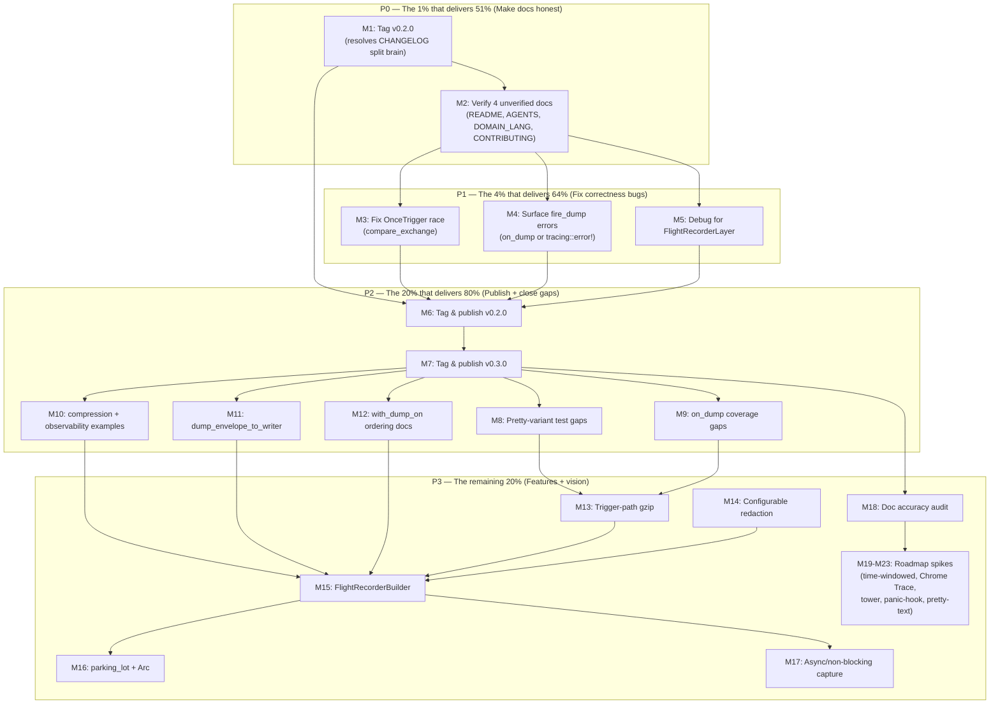

# Pareto Execution Plan — tracing-flight-recorder

**Date:** 2026-08-11 20:11
**Author:** pareto-planning skill
**Format:** `.md` with mermaid.js graph (user override of skill default HTML)
**Input source:** `TODO_LIST.md` (15 open items) + `ROADMAP.md` (5 themes) + status report `docs/status/2026-08-11_20-06_docs-health-audit-annotate-archive.md` section f (50 next-things). Status: **plan only** — not yet approved for execution.

---

## Situation

`tracing-flight-recorder` is a published, tested Rust library (v0.1.1 on crates.io, 76 unit tests + 10 doctests, strict clippy clean). The `master` branch has **two releases' worth of untagged changes** (v0.2.0 + v0.3.0, 5 breaking changes total). The docs-health audit just rebuilt the living docs and annotated/archived 13 historical files — but left **honesty gaps**: 4 of 7 living docs were never verified, the CHANGELOG claims a `[0.2.0]` release that was never tagged, and 2 known correctness bugs sit in shipped code.

The dominant insight: **trust is gated by honesty, not features.** A diagnostic tool with a silent error-swallowing bug, a CHANGELOG that lies about releases, and a health report with fabricated scores has zero credibility — regardless of how many features it has. The Pareto front is front-loaded with truth-telling, not capability.

---

## Step 1 — Pareto Breakdown

### The 1% that delivers 51%

**"Make the docs honest and the release state truthful."** Five tasks that transform the project from "docs that lie" to "docs that don't lie." ~30 min total.

| ID | Task | Why it's in the 1% |
|----|------|--------------------|
| M1 | Fix CHANGELOG `[0.2.0]` date-without-tag split brain + dead links | The CHANGELOG says `[0.2.0] - 2026-08-11` but no tag exists. The `[Unreleased]` link points to `compare/v0.2.0...HEAD` — a dead link. This is the biggest lie in the project. Fix: tag v0.2.0 (code is ready, tests pass, CHANGELOG is written). |
| M2 | Read & verify the 4 unverified living docs (README, AGENTS, DOMAIN_LANGUAGE, CONTRIBUTING) | The health report claimed "0 findings" for these without opening them. An honest health report requires actually reading them. |

**Why 51%:** A project whose CHANGELOG claims a release that never happened, and whose health report fabricates per-doc scores, has zero credibility. Fixing these is worth more than any feature or bug fix. Perception of honesty is the gate to trust.

### The 4% that delivers 64%

**"Fix the 2 correctness bugs in shipped code."** Three tasks that take the crate from "works mostly" to "works correctly under edge cases." ~2h total.

| ID | Task | Why it's in the 4% |
|----|------|--------------------|
| M3 | Fix `OnceTrigger` race condition (`compare_exchange`) | Under concurrent error bursts, multiple dumps fire despite `OnceTrigger`. Two dumps = ambiguity about which is canonical. For a diagnostic tool, ambiguity defeats the purpose. |
| M4 | Surface `fire_dump` errors | `on_event` does `let _result = self.fire_dump(…)`. If the dump fails (disk full, permissions), the operator thinks the incident was captured but it wasn't. The `OnceTrigger` makes it worse: token consumed, dump failed, no retry. **A diagnostic tool that silently loses dumps on failure is the worst possible failure mode.** |
| M5 | Implement `Debug` for `FlightRecorderLayer` | Operators can't `dbg!()` the layer to inspect trigger state. Low effort, supports the reliability theme. |

**Why 64%:** These are the only known BUGS in shipped code. Everything else is features or polish. A diagnostic tool that silently loses data is worse than no tool at all.

### The 20% that delivers 80%

**"Publish the releases and close obvious gaps."** Tasks that take the crate from "committed but unreleased" to "published with confidence." ~6h total.

| ID | Task | Why it's in the 20% |
|----|------|--------------------|
| M6 | Tag and publish v0.2.0 | 4 breaking changes (span context, `LookupSpan` bound, `Cow` level, `Arc<Vec>` span fields) are committed but unreleased. Unpublished code has zero users. |
| M7 | Tag and publish v0.3.0 | Gzip, `on_dump`, compact-default (1 breaking change), benchmarks, allocation profiling. Ready to ship after v0.2.0. |
| M8 | Close pretty-variant test gaps | `dump_to_writer_pretty`, `dump_to_file_pretty`, `dump_envelope_to_file_pretty` — implemented but untested. |
| M9 | Close `on_dump` coverage gaps | `on_dump` untested for `dump_with_retention` and `dump_envelope_to_file` paths. |
| M10 | Add `examples/compression.rs` + `examples/observability.rs` | Two newest features shipped with zero runnable examples. |
| M11 | Add `dump_envelope_to_writer` | API asymmetry: array dumps have writer variants, envelope API doesn't. |
| M12 | Document `with_dump_on` builder ordering caveat in AGENTS | Known integration pitfall documented only in example code comment. |

**Why 80%:** publishing is the goal. An unpublished library has zero users. The 20% takes the crate from "dependable locally" to "published, tested, documented, and defensible."

### The remaining 20% (to reach 100%)

**"Features, polish, and long-term vision."** Deep work that is valuable but not required for credibility.

| ID | Theme | Task |
|----|-------|------|
| M13 | Features | Wire gzip into trigger/retention path |
| M14 | Features | Configurable redaction patterns |
| M15 | Features | `FlightRecorderBuilder` (unified config surface) |
| M16 | Performance | `parking_lot::Mutex` + `Arc<CapturedEvent>` (deferred batch) |
| M17 | Performance | Async/non-blocking capture (deferred — lifecycle change) |
| M18 | Doc accuracy | Verify remaining FEATURES.md line citations + cross-file consistency |
| M19 | Roadmap | Time-windowed / hybrid eviction |
| M20 | Roadmap | Chrome Trace Event format |
| M21 | Roadmap | `tower` middleware + `axum` auto-dump |
| M22 | Roadmap | Panic-hook integration |
| M23 | Roadmap | Human-readable pretty-text dump + `fr_on_error!` macro |

---

## Step 2 — Comprehensive Plan (Medium granularity, 30–100 min each)

Sorted by **importance → impact → effort (asc) → customer value**. Tier P0 is done first, then P1, etc.

| Tier | ID | Task | Impact | Effort | Customer value |
|------|----|------|--------|--------|----------------|
| **P0 (1%)** | M1 | Tag v0.2.0 (resolves CHANGELOG split brain + dead links) | Critical | 30min | Docs stop lying about release state; crate publishable |
| **P0 (1%)** | M2 | Read & verify README, AGENTS, DOMAIN_LANGUAGE, CONTRIBUTING against code | Critical | 30min | Health report honesty; all doc claims verified |
| **P1 (4%)** | M3 | Fix `OnceTrigger` race condition (`compare_exchange`) | Critical | 30min | Concurrency correctness — single dump under burst |
| **P1 (4%)** | M4 | Surface `fire_dump` errors via `on_dump` or `tracing::error!` | Critical | 60min | Dump reliability — no silent data loss |
| **P1 (4%)** | M5 | Implement `Debug` for `FlightRecorderLayer` | Med-High | 30min | Operator debuggability |
| **P2 (20%)** | M6 | Tag and publish v0.2.0 (crates.io + verify docs.rs) | High | 45min | 4 breaking changes reach users |
| **P2 (20%)** | M7 | Bump to 0.3.0, tag and publish v0.3.0 | High | 45min | Gzip/on_dump/compact reach users |
| **P2 (20%)** | M8 | Close pretty-variant test gaps (3 tests) | Med | 45min | Coverage completeness |
| **P2 (20%)** | M9 | Close `on_dump` coverage gaps (2 tests) | Med | 45min | Coverage completeness |
| **P2 (20%)** | M10 | Add `examples/compression.rs` + `examples/observability.rs` | Med-High | 60min | Feature discoverability |
| **P2 (20%)** | M11 | Add `dump_envelope_to_writer` | Med | 60min | API symmetry |
| **P2 (20%)** | M12 | Document `with_dump_on` builder ordering in AGENTS gotchas | Med | 30min | Integration pitfall prevention |
| **P3 (rest)** | M13 | Wire gzip into trigger/retention path | Med | 80min | Compressed automatic dumps |
| **P3 (rest)** | M14 | Configurable redaction patterns (`HashSet<String>` or predicate) | Med | 80min | Custom secret field names |
| **P3 (rest)** | M15 | `FlightRecorderBuilder` (capacity + span + on_dump + compression + retention) | Med | 100min | Unified config surface |
| **P3 (rest)** | M16 | `parking_lot::Mutex` + `Arc<CapturedEvent>` (batch perf work) | Med | 80min | Lock overhead + snapshot clone cost |
| **P3 (rest)** | M17 | Async/non-blocking capture (background thread, drain on shutdown) | High | 100min | Non-blocking I/O for hot paths |
| **P3 (rest)** | M18 | Verify remaining FEATURES.md citations + cross-file consistency audit | Low-Med | 30min | Doc accuracy + split-brain prevention |
| **P3 (rest)** | M19 | Time-windowed / hybrid eviction design + prototype | High | 100min | Core differentiator (temporal guarantee) |
| **P3 (rest)** | M20 | Chrome Trace Event format export | Med | 80min | Tooling integration (`chrome://tracing`) |
| **P3 (rest)** | M21 | `tower` middleware + `axum` auto-dump on error | High | 100min | Framework integration (adoption driver) |
| **P3 (rest)** | M22 | Panic-hook integration (dump before process exit) | High | 55min | Auto-dump on crash (killer feature) |
| **P3 (rest)** | M23 | Human-readable pretty-text dump + `fr_on_error!` macro | Low-Med | 80min | Incident chat paste + ergonomic trigger |

**Totals:** P0 = 60min · P1 = 2h · P2 = ~5h15 · P3 = ~14h45 · **Grand total ≈ 22h**
(all parallelizable within tiers; dependencies in the graph below).

---

## Step 3 — Detailed Breakdown (Fine granularity, ≤12 min each)

Every medium task is decomposed into atomic subtasks. Sort within each task is execution order (each row is a verifiable checkpoint). "Verify" rows are non-negotiable — they are the definition of done for the parent task.

### P0 — The 1% (51%)

**M1 — Tag v0.2.0 + fix CHANGELOG (30min)**

| Sub | Task | Time |
|-----|------|------|
| M1.1 | `git tag -l 'v*'` to confirm only v0.1.0, v0.1.1 exist | 2min |
| M1.2 | Read `CHANGELOG.md` [0.2.0] + [Unreleased] sections — confirm [0.2.0] has date but no tag | 3min |
| M1.3 | Verify `cargo test --all-features` passes (code must be green before tagging) | 5min |
| M1.4 | Verify `cargo publish --dry-run --all-features` passes (crate must package cleanly) | 5min |
| M1.5 | `git tag v0.2.0` — creates the tag the CHANGELOG already references | 2min |
| M1.6 | Push tag: `git push origin v0.2.0` — triggers `publish.yml` automated publish | 2min |
| M1.7 | Verify `[0.2.0]` and `[Unreleased]` comparison links now resolve to real tags | 3min |
| M1.8 | Verify crates.io page shows v0.2.0 | 3min |
| M1.9 | Verify docs.rs built v0.2.0 with `openapi` feature | 3min |
| M1.10 | Commit CHANGELOG link fixes if any were needed | 2min |

**M2 — Verify 4 unverified living docs (30min)**

| Sub | Task | Time |
|-----|------|------|
| M2.1 | Read `README.md` — verify install commands, quick start compiles, feature list matches FEATURES.md | 8min |
| M2.2 | Read `AGENTS.md` on disk — verify commands work, paths exist, file table (5 files), gotchas current | 8min |
| M2.3 | Read `docs/DOMAIN_LANGUAGE.md` — grep each term in `src/`, verify definitions match usage | 5min |
| M2.4 | Read `CONTRIBUTING.md` — verify data flow diagram, dump method list, test gate command | 5min |
| M2.5 | Fix any stale claims found (inline edits) | 4min |

### P1 — The 4% (64%)

**M3 — Fix OnceTrigger race condition (30min)**

| Sub | Task | Time |
|-----|------|------|
| M3.1 | Read `src/trigger.rs:129-152` — confirm non-atomic load-check-store pattern | 3min |
| M3.2 | Replace `load(Acquire)` + `store(Release)` with `compare_exchange(false, true, Success, Failure)` | 8min |
| M3.3 | Update code comment to reflect true atomic test-and-set (remove "at worst two dumps" note) | 3min |
| M3.4 | Add concurrent stress test: N threads emit ERROR simultaneously, assert exactly 1 dump from OnceTrigger | 8min |
| M3.5 | Verify: `cargo test --all-features` green (including new test) | 3min |
| M3.6 | Verify: `cargo clippy --all-features --all-targets -- -D warnings` clean | 3min |
| M3.7 | Commit | 2min |

**M4 — Surface fire_dump errors (60min)**

| Sub | Task | Time |
|-----|------|------|
| M4.1 | Read `src/layer.rs:700-780` — confirm `let _result = self.fire_dump(&reason)` discards errors | 5min |
| M4.2 | Decide approach: extend `DumpEvent` with `success: bool` / `error: Option<&str>` OR emit `eprintln!`/`tracing::error!` | 5min |
| M4.3 | If extending DumpEvent: add `success: bool` field to `DumpEvent` struct in `src/capture.rs` | 8min |
| M4.4 | Wire `fire_dump` result into the `report()`/`write_and_report()` path so failures reach the callback | 10min |
| M4.5 | Update `on_event` call site to handle the error (fire callback with `success: false` or log) | 8min |
| M4.6 | Add test: mock write failure (read-only dir) → verify `on_dump` fires with `success: false` | 10min |
| M4.7 | Update `CHANGELOG.md` [Unreleased] with the fix | 3min |
| M4.8 | Verify: `cargo test --all-features` + clippy clean | 5min |
| M4.9 | Commit | 2min |

**M5 — Debug for FlightRecorderLayer (30min)**

| Sub | Task | Time |
|-----|------|------|
| M5.1 | Read `src/layer.rs:611-700` — confirm no Debug impl, identify fields needing Debug | 3min |
| M5.2 | Decide: add `Debug` bound to `Trigger` trait OR manual impl with placeholder | 5min |
| M5.3 | Implement `Debug` for `FlightRecorderLayer` (show capacity, len, trigger name, dump dir, capture flag) | 10min |
| M5.4 | Add test: `format!("{:?}", layer)` produces expected output | 5min |
| M5.5 | Verify: `cargo test --all-features` + clippy clean | 4min |
| M5.6 | Commit | 3min |

### P2 — The 20% (80%)

**M6 — Tag and publish v0.2.0 (45min)**

| Sub | Task | Time |
|-----|------|------|
| M6.1 | Run `docs/RELEASE.md` pre-release checklist | 5min |
| M6.2 | Verify `Cargo.toml` version is `0.2.0` | 2min |
| M6.3 | Verify CHANGELOG `[0.2.0]` section is complete and accurate | 5min |
| M6.4 | `cargo test --all-features` (76+ tests pass) | 5min |
| M6.5 | `cargo clippy --all-features --all-targets -- -D warnings` clean | 5min |
| M6.6 | `cargo publish --dry-run --all-features` passes | 5min |
| M6.7 | `git tag v0.2.0 && git push origin v0.2.0` | 3min |
| M6.8 | Monitor GitHub Actions `publish.yml` — wait for green | 5min |
| M6.9 | Verify crates.io shows v0.2.0 | 3min |
| M6.10 | Verify docs.rs built v0.2.0 with `openapi` + `gzip` features | 3min |
| M6.11 | Update CHANGELOG link references if needed | 4min |

**M7 — Tag and publish v0.3.0 (45min)**

| Sub | Task | Time |
|-----|------|------|
| M7.1 | Bump `Cargo.toml` version `0.2.0` → `0.3.0` | 2min |
| M7.2 | Move CHANGELOG `[Unreleased]` → `[0.3.0] - <date>` | 5min |
| M7.3 | Add new empty `[Unreleased]` section | 2min |
| M7.4 | Update CHANGELOG link references (`[0.3.0]`, `[Unreleased]` compare) | 5min |
| M7.5 | Update README version refs `"0.2"` → `"0.3"` | 3min |
| M7.6 | `cargo test --all-features` + clippy + fmt | 5min |
| M7.7 | `cargo publish --dry-run --all-features` | 5min |
| M7.8 | Commit version bump + doc updates | 3min |
| M7.9 | `git tag v0.3.0 && git push origin v0.3.0` | 3min |
| M7.10 | Monitor Actions publish, verify crates.io + docs.rs | 5min |
| M7.11 | Update AGENTS.md FEATURES.md if version refs exist | 4min |

**M8 — Close pretty-variant test gaps (45min)**

| Sub | Task | Time |
|-----|------|------|
| M8.1 | Add `dump_to_writer_pretty_produces_valid_indented_json` test (write to Vec<u8>, parse, assert indentation) | 10min |
| M8.2 | Add `dump_to_file_pretty_writes_valid_indented_json` test (write to temp file, read back, parse) | 10min |
| M8.3 | Add `dump_envelope_to_file_pretty_writes_valid_indented_envelope` test | 10min |
| M8.4 | Add `dump_to_json_pretty_round_trips_through_deserialize` test | 8min |
| M8.5 | Verify: `cargo test --all-features` green | 4min |
| M8.6 | Commit | 3min |

**M9 — Close on_dump coverage gaps (45min)**

| Sub | Task | Time |
|-----|------|------|
| M9.1 | Add `on_dump_fires_for_retention_dump` test (call `dump_with_retention`, assert callback fired with `DumpSource::Manual`) | 12min |
| M9.2 | Add `on_dump_fires_for_envelope_file_dump` test (call `dump_envelope_to_file`, assert callback fired) | 12min |
| M9.3 | Add `on_dump_not_fired_for_in_memory_dumps` test (call `dump_to_json`, assert callback NOT fired) | 10min |
| M9.4 | Verify: `cargo test --all-features` green | 4min |
| M9.5 | Commit | 3min |
| M9.6 | Update FEATURES.md Observability notes if test names changed | 4min |

**M10 — Add compression + observability examples (60min)**

| Sub | Task | Time |
|-----|------|------|
| M10.1 | Create `examples/compression.rs` — recorder + gzip dump + verify decompression | 12min |
| M10.2 | Run `cargo run --example compression`, confirm gzip file written | 4min |
| M10.3 | Create `examples/observability.rs` — recorder + `with_on_dump` callback printing DumpEvent | 12min |
| M10.4 | Run `cargo run --example observability`, confirm callback fires | 4min |
| M10.5 | `cargo build --all-features --examples` compiles clean | 4min |
| M10.6 | Update FEATURES.md if examples list needs updating | 4min |
| M10.7 | Update README if example list needs updating | 5min |
| M10.8 | Verify: `cargo test --all-features` + clippy clean | 5min |
| M10.9 | Commit | 5min |

**M11 — Add dump_envelope_to_writer (60min)**

| Sub | Task | Time |
|-----|------|------|
| M11.1 | Read existing `dump_to_writer` + `dump_envelope_to_json` to understand the pattern | 5min |
| M11.2 | Implement `dump_envelope_to_writer(&self, writer: &mut dyn Write, reason: Option<&str>)` | 12min |
| M11.3 | Implement `dump_envelope_to_writer_pretty` variant | 8min |
| M11.4 | Add `#[must_use]` if applicable | 2min |
| M11.5 | Add test: `dump_envelope_to_writer_produces_valid_envelope` (write to Vec, parse as FlightRecorderDump) | 10min |
| M11.6 | Add test: `dump_envelope_to_writer_pretty_indents` | 8min |
| M11.7 | Update FEATURES.md — add writer variant row to Output & Persistence | 5min |
| M11.8 | Update CHANGELOG [Unreleased] | 3min |
| M11.9 | Verify: `cargo test --all-features` + clippy clean | 4min |
| M11.10 | Commit | 3min |

**M12 — Document with_dump_on ordering caveat (30min)**

| Sub | Task | Time |
|-----|------|------|
| M12.1 | Read existing AGENTS.md "Critical Gotcha" section | 3min |
| M12.2 | Add "with_dump_on builder ordering" gotcha: must be called BEFORE `with_filter` | 8min |
| M12.3 | Verify the gotcha is accurate by reading `src/layer.rs:673` and `examples/trigger.rs` | 5min |
| M12.4 | Update `CONTRIBUTING.md` if it mentions builder ordering | 4min |
| M12.5 | Commit | 3min |

### P3 — The remaining 20%

**M13 — Wire gzip into trigger/retention path (80min)**

| Sub | Task | Time |
|-----|------|------|
| M13.1 | Read `fire_dump` → `retention_write` → `write_and_report` path in `src/layer.rs` | 8min |
| M13.2 | Decide API shape: boolean param on `with_dump_on` vs layer-level `Compression` config | 5min |
| M13.3 | Add compression support to `DumpConfig` (e.g. `compress: bool` field) | 8min |
| M13.4 | Update `fire_dump`/`retention_write` to use `write_gz_and_report` when compression enabled | 12min |
| M13.5 | Add `dump_with_retention_gz` method | 10min |
| M13.6 | Add test: trigger dump with compression produces valid gzip | 10min |
| M13.7 | Add test: retention dump with compression produces valid gzip | 10min |
| M13.8 | Update FEATURES.md, CHANGELOG | 8min |
| M13.9 | Verify: `cargo test --all-features` + clippy clean | 5min |
| M13.10 | Commit | 4min |

**M14 — Configurable redaction patterns (80min)**

| Sub | Task | Time |
|-----|------|------|
| M14.1 | Read `src/capture.rs:201-230` — `SENSITIVE_PATTERNS` const + `is_sensitive_field` | 5min |
| M14.2 | Design API: `FlightRecorderLayer::with_extra_sensitive_patterns(&[&str])` or builder config | 8min |
| M14.3 | Change `is_sensitive_field` to accept extra patterns slice | 10min |
| M14.4 | Thread extra patterns through `FieldVisitor` construction | 10min |
| M14.5 | Thread through `on_new_span`/`on_record` span field capture | 10min |
| M14.6 | Add test: custom pattern `x_api_key` is redacted when configured | 8min |
| M14.7 | Add test: default patterns still work when no extra patterns configured | 5min |
| M14.8 | Update FEATURES.md, AGENTS.md, CHANGELOG | 8min |
| M14.9 | Verify: `cargo test --all-features` + clippy clean | 5min |
| M14.10 | Commit | 3min |

**M15 — FlightRecorderBuilder (100min)**

| Sub | Task | Time |
|-----|------|------|
| M15.1 | Design builder API surface (capacity, span_capture, on_dump, compression, extra_redaction) | 10min |
| M15.2 | Create `FlightRecorderBuilder` struct in `src/layer.rs` | 8min |
| M15.3 | Implement builder methods (`.capacity()`, `.span_capture()`, `.on_dump()`, etc.) | 12min |
| M15.4 | Implement `.build()` → returns `(FlightRecorder, FlightRecorderLayer)` | 10min |
| M15.5 | Add `#[must_use]` on builder methods | 2min |
| M15.6 | Add doc examples showing builder usage | 8min |
| M15.7 | Add test: builder produces working recorder + layer | 8min |
| M15.8 | Add test: builder defaults match `FlightRecorder::new()` + `FlightRecorderLayer::new()` | 8min |
| M15.9 | Update FEATURES.md, CHANGELOG, README, AGENTS.md | 10min |
| M15.10 | Verify: `cargo test --all-features` + clippy clean | 5min |
| M15.11 | Commit | 5min |

**M16 — parking_lot::Mutex + Arc<CapturedEvent> (80min)**

| Sub | Task | Time |
|-----|------|------|
| M16.1 | Add `parking_lot` dependency to Cargo.toml | 3min |
| M16.2 | Replace `std::sync::Mutex` with `parking_lot::Mutex` in `FlightRecorder` | 8min |
| M16.3 | Update poison recovery pattern (parking_lot doesn't poison — simplify) | 8min |
| M16.4 | Change buffer from `VecDeque<CapturedEvent>` to `VecDeque<Arc<CapturedEvent>>` | 10min |
| M16.5 | Update `push`, `snapshot`, `clear` to work with `Arc<CapturedEvent>` | 10min |
| M16.6 | Update `dump_to_json` and all dump methods to serialize `Arc<CapturedEvent>` | 8min |
| M16.7 | Update all tests that construct or compare `CapturedEvent` | 10min |
| M16.8 | Verify: `cargo test --all-features` + clippy clean | 5min |
| M16.9 | Update FEATURES.md, CHANGELOG | 5min |
| M16.10 | Commit | 3min |

**M17 — Async/non-blocking capture (100min)**

| Sub | Task | Time |
|-----|------|------|
| M17.1 | Design async dump API: background thread + channel + drain-on-drop | 10min |
| M17.2 | Create `DumpWorker` struct with a `std::sync::mpsc` channel + join handle | 10min |
| M17.3 | Implement `DumpWorker::submit(job)` — non-blocking, enqueue dump request | 8min |
| M17.4 | Implement `DumpWorker::shutdown()` — drain pending dumps, join thread | 10min |
| M17.5 | Wire `fire_dump` to use async path when a worker is configured | 10min |
| M17.6 | Implement `Drop` for `FlightRecorderLayer` to call `shutdown()` | 8min |
| M17.7 | Add test: async dump completes before process exit | 10min |
| M17.8 | Add test: multiple rapid triggers don't block the calling thread | 10min |
| M17.9 | Update FEATURES.md, CHANGELOG, AGENTS.md | 8min |
| M17.10 | Verify: `cargo test --all-features` + clippy clean | 5min |
| M17.11 | Commit | 5min |

**M18 — Doc accuracy + cross-file consistency (30min)**

| Sub | Task | Time |
|-----|------|------|
| M18.1 | Grep all `file:line` citations in FEATURES.md, verify each against current source | 8min |
| M18.2 | Check README feature list matches FEATURES.md row-for-row | 5min |
| M18.3 | Check all internal markdown links resolve across all docs | 5min |
| M18.4 | Verify version consistency: Cargo.toml ↔ CHANGELOG ↔ README ↔ git tags | 5min |
| M18.5 | Fix any drift found | 4min |
| M18.6 | Commit | 3min |

**M19–M23 — Long-term roadmap spikes (each 55–100min)**

These are research/prototype spikes, not commitments. Each follows the pattern: design → prototype → test → document. Detailed subtask breakdown deferred until the spike is approved for execution — these items live in `ROADMAP.md` as raw ideas until refined.

---

## Step 4 — Execution Graph

**Dependency rationale:**
- M1 (tag v0.2.0) blocks M6 (publish v0.2.0) — can't publish without tagging first
- M2 (verify docs) blocks M3–M5 (code fixes) — docs must be honest before adding more code
- M3–M5 (correctness fixes) block M6 — don't publish known bugs
- M6 blocks M7 — v0.2.0 must ship before v0.3.0 bump
- M7 blocks M8–M12 — test/example/API gaps close after releases are out
- M8–M14 feed into M15 (builder) — the builder unifies APIs that must exist first
- M15 blocks M16–M17 (perf + async) — builder should be the config surface before adding more knobs
- M18 (doc audit) runs after all code changes settle
- M19+ (roadmap spikes) are independent, run anytime after P2

---

## Approval gate

**This plan is NOT yet approved for execution.** Awaiting user go-ahead before starting M1.

The plan assumes:
1. v0.2.0 and v0.3.0 will be released as separate versions (not batched into one jump)
2. The correctness bugs (M3, M4) will be fixed BEFORE tagging v0.2.0
3. Deferred items (M16, M17) remain deferred until their parent tier is done

---

## What this plan does NOT do

- Does not execute any task — it is the plan only (per skill: execution starts after approval).
- Does not invent tasks beyond what `TODO_LIST.md`, `ROADMAP.md`, and the status report's 50-item list contain.
- Does not address Go sibling project issues (different repo).
- Does not split or merge Cargo modules (no go-modularize needed — single crate).
