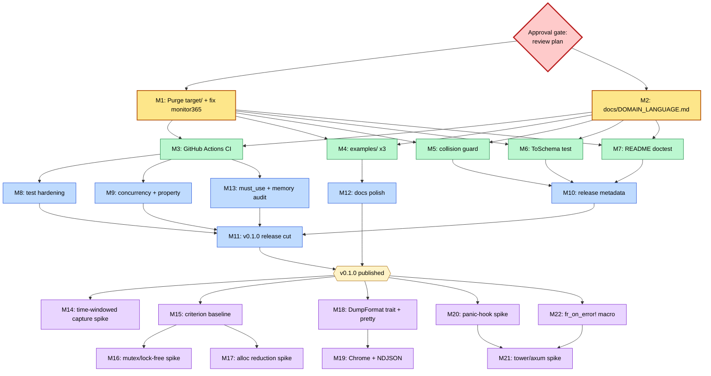

# Pareto Execution Plan — tracing-flight-recorder

**Date:** 2026-08-10 13:51
**Author:** docs-health + pareto-planning skills
**Format override:** `.md` with mermaid.js graph (pareto-planning skill default is styled HTML + D2 — overridden by explicit user instruction in step 6)
**Input source:** `TODO_LIST.md` (5 verified items) + `ROADMAP.md` (5 themes) + `docs/status/2026-08-10_13-45_docs-health-and-self-review.md` section (f) 50 next-things. Status: **plan only** — not yet approved for execution (see "Approval gate").

---

## Situation

`tracing-flight-recorder` is a working, tested Rust library (16 tests pass, strict
clippy clean) that is **unreleased and has visible hygiene defects**: 680 build
artifacts committed to git, a leaked foreign project name in public docs, no CI,
no runnable examples, and one missing must-have doc. The internal engineering is
sound; the *presentation and trust infrastructure* around it is not. This plan
ranks everything from "fix the embarrassment" through "ship v0.1.0" through
"v0.2+ roadmap spikes."

The dominant insight: **value is gated by trust, not features.** A flawless ring
buffer with a leaked name and no CI delivers zero adoption. The Pareto front is
therefore front-loaded with hygiene + onboarding, not with new capabilities.

---

## Step 1 — Pareto Breakdown

### The 1% that delivers 51%

**"Make the repo clean and presentable."** Four trivial fixes that transform the
repo from "obviously defective" to "clean." ~40 min total.

| ID | Task | Why it's in the 1% |
|----|------|--------------------|
| M1 | Purge 680 tracked `target/` artifacts + fix both `monitor365` leaks | Single biggest perceived-quality jump; clones go from megabytes of junk to lean; the name leak is an active embarrassment on a public crate |
| M2 | Build `docs/DOMAIN_LANGUAGE.md` | Closes the only missing must-have doc; completes the documentation set; lifts docs-health Fitness 9.0 → 10.0 |

**Why 51%:** right now the repo *looks unfinished/leaky*. A reviewer's first
impression is "680 files in target/? 'monitor365'? is this even meant to be
public?" Fixing that impression is worth more than any feature. Perception is the
gate to adoption.

### The 4% that delivers 64%

**"Make it usable by others with confidence."** Six tasks that take it from
"clean" to "trustworthy enough to depend on." ~6 h.

| ID | Task | Why it's in the 4% |
|----|------|--------------------|
| M3 | GitHub Actions CI (build/test/clippy/doc/MSRV) | Without CI the strict clippy gate is aspirational; CI is the proof of quality |
| M4 | `examples/` — 3 runnable examples (minimal, retention, per-layer-filter) | The crate sells on Quick Start but ships nothing runnable; examples are the #1 onboarding asset for a tracing library |
| M5 | `dump_with_retention` same-second collision guard | Real correctness bug (two dumps in one second silently overwrite) |
| M6 | `utoipa::ToSchema` integration test | Promotes a feature from PARTIALLY_FUNCTIONAL → FULLY_FUNCTIONAL |
| M7 | README Quick Start as compile-tested doctest + reconcile "30–60s" claim | The thing we advertise must actually compile; the perf claim must be honest |

**Why 64%:** a library nobody can confidently use delivers zero value regardless
of how clean its internals are. CI + examples + tested claims = "dependable."

### The 20% that delivers 80%

**"Release-ready v0.1.0."** Everything needed to publish with confidence. ~8 h.

| ID | Task |
|----|------|
| M8  | Test hardening: poison-recovery, Unicode redaction, nested-dir dump, non-json retention filtering |
| M9  | Concurrency + property tests (proptest eviction invariant; multi-thread stress) |
| M10 | Release metadata: Cargo.lock policy decision, `cargo publish --dry-run`, keywords/categories, exclude audit |
| M11 | v0.1.0 release cut: CHANGELOG versioned section, crate-level doc test, tag |
| M12 | Docs polish: data-flow diagram, FEATURES↔source cross-links, CONTRIBUTING, re-run docs-health |
| M13 | `#[must_use]` audit + measured memory footprint (vs README "~200–500 KB" claim) |

**Why 80%:** publishing is the goal. An unpublished library has zero users. The
20% takes the crate from "dependable locally" to "published and defensible."

### The remaining 20% (to reach 100%)

**"v0.2+ roadmap spikes."** Deep work that is valuable but not required for a
credible first release. These are research/prototype spikes, not commitments.

| ID | Theme | Task |
|----|-------|------|
| M14 | Time-windowed capture | Design + prototype time-based & hybrid eviction, buffer time-span metadata |
| M15 | Hot-path perf | Criterion benchmark baseline |
| M16 | Hot-path perf | `parking_lot::Mutex` vs lock-free ring-buffer evaluation spike |
| M17 | Hot-path perf | Allocation-reduction + zero-copy snapshot prototype |
| M18 | Output formats | `DumpFormat` trait + human-readable pretty-text dump |
| M19 | Output formats | Chrome Trace Event + NDJSON formats |
| M20 | Framework ergonomics | Panic-hook integration (dump before exit) |
| M21 | Framework ergonomics | `tower` middleware + `axum` auto-dump on error |
| M22 | Framework ergonomics | `fr_on_error!` macro helper |

**Why last:** these are where the crate *goes after* it exists and is published.
They are the 20% effort that turns a good library into a great one — but they
depend on a published, trusted foundation (the 80%) existing first.

---

## Step 2 — Comprehensive Plan (medium granularity, 30–100 min each)

Sorted by **importance → impact → effort (asc) → customer value**. Tier P0 is
done first, then P1, etc. "Effort" is the sum of the subtask estimates in Step 3.

| Tier | ID | Task | Impact | Effort | Customer value |
|------|----|------|--------|--------|----------------|
| **P0 (1%)** | M1 | Purge tracked `target/` + fix both `monitor365` leaks | Critical | 25min | Repo no longer looks broken/leaky |
| **P0 (1%)** | M2 | Build `docs/DOMAIN_LANGUAGE.md` | High | 30min | Completes doc set; Fitness 9→10 |
| **P1 (4%)** | M5 | `dump_with_retention` same-second collision guard + test | High | 35min | Fixes silent data-loss bug |
| **P1 (4%)** | M6 | `utoipa::ToSchema` integration test | Med-High | 30min | Promotes feature to FULLY_FUNCTIONAL |
| **P1 (4%)** | M7 | README Quick Start doctest + reconcile timing claim | Med-High | 30min | Advertised code compiles; honest perf |
| **P1 (4%)** | M4 | `examples/` directory (3 runnable examples) | High | 65min | #1 onboarding asset |
| **P1 (4%)** | M3 | GitHub Actions CI (build/test/clippy/doc/MSRV) | Critical | 60min | Proves quality; prevents regression |
| **P2 (20%)** | M8 | Test hardening batch (poison/Unicode/nested/non-json) | Med | 55min | Closes 4 correctness gaps |
| **P2 (20%)** | M13 | `#[must_use]` audit + memory footprint measurement | Med | 25min | API hygiene + honest README claim |
| **P2 (20%)** | M10 | Release metadata prep (Cargo.lock policy, dry-run, keywords, exclude) | Med | 35min | crates.io readiness |
| **P2 (20%)** | M9 | Concurrency + property tests | Med | 45min | Eviction invariant + thread safety proof |
| **P2 (20%)** | M11 | v0.1.0 release cut (CHANGELOG, doc test, tag) | High | 35min | The publish event itself |
| **P2 (20%)** | M12 | Docs polish (diagram, cross-links, CONTRIBUTING, re-VERIFY) | Med | 45min | Defensible, navigable docs |
| **P3 (rest)** | M15 | Criterion hot-path benchmark baseline | Med | 55min | Data before optimizing |
| **P3 (rest)** | M14 | Time-windowed capture design + prototype | High | 100min | Core differentiator vs count-only |
| **P3 (rest)** | M18 | `DumpFormat` trait + pretty-text dump | Med | 80min | Extensibility + chat-paste output |
| **P3 (rest)** | M20 | Panic-hook integration | High | 55min | Auto-dump on panic (killer feature) |
| **P3 (rest)** | M19 | Chrome Trace Event + NDJSON formats | Med | 80min | Tooling integration |
| **P3 (rest)** | M16 | `parking_lot` / lock-free evaluation spike | Med | 85min | Perf path decision |
| **P3 (rest)** | M17 | Allocation-reduction + zero-copy snapshot prototype | Med | 85min | Hot-path cost reduction |
| **P3 (rest)** | M22 | `fr_on_error!` macro helper | Low-Med | 40min | Ergonomic dump trigger |
| **P3 (rest)** | M21 | `tower` middleware + `axum` auto-dump | High | 100min | Framework integration (adoption driver) |

**Totals:** P0 = 55min · P1 = ~3h55 · P2 = ~4h40 · P3 = ~11h30 · **Grand total ≈ 21h**
(all parallelizable within tiers; dependencies in the graph below).

---

## Step 3 — Detailed Breakdown (fine granularity, ≤12 min each)

Every medium task is decomposed into atomic subtasks. Sort within each task is
execution order (each row is a verifiable checkpoint). "Verify" rows are
non-negotiable — they are the definition of done for the parent task.

### P0 — The 1% (51%)

**M1 — Purge tracked `target/` + fix `monitor365` leaks (25min)**

| Sub | Task | Time |
|-----|------|------|
| M1.1 | `git rm -r --cached target/` | 3min |
| M1.2 | Verify `git status` shows ~680 deletions, working tree intact | 2min |
| M1.3 | Edit `README.md:21` — remove the nonsensical "Zero monitor365 dependencies" bullet | 4min |
| M1.4 | Edit `src/layer.rs:203` — replace `monitor365=debug` example with `my_app=debug` | 4min |
| M1.5 | `grep -rn monitor365` — verify zero occurrences remain | 2min |
| M1.6 | Verify: `cargo build && cargo test --all-features && cargo clippy --all-features -- -D warnings` green | 5min |
| M1.7 | Commit the purge + leak fixes | 5min |

**M2 — Build `docs/DOMAIN_LANGUAGE.md` (30min)**

| Sub | Task | Time |
|-----|------|------|
| M2.1 | Extract domain terms from `capture.rs` + `layer.rs` (flight recorder, ring buffer, captured event, field visitor, layer, snapshot, capacity, retention, redaction) | 10min |
| M2.2 | Write glossary table (term / definition / where used) | 10min |
| M2.3 | `grep` each term in `src/` — verify every term is actually used; drop dead ones | 5min |
| M2.4 | Verify: re-run docs-health VERIFY — Fitness should reach 10.0 | 5min |

### P1 — The 4% (64%)

**M5 — `dump_with_retention` collision guard (35min)**

| Sub | Task | Time |
|-----|------|------|
| M5.1 | Decide scheme: append `-{counter}` if filename exists, OR sub-second (`%Y%m%dT%H%M%S%.3f`) | 5min |
| M5.2 | Update `dump_with_retention` filename generation in `src/layer.rs:140` | 10min |
| M5.3 | Add test `dump_with_retention_does_not_overwrite_same_second` | 10min |
| M5.4 | Verify: `cargo test --all-features` green | 5min |
| M5.5 | Update FEATURES.md notes if behavior changed | 5min |

**M6 — `utoipa::ToSchema` test (30min)**

| Sub | Task | Time |
|-----|------|------|
| M6.1 | Add `utoipa` to `[dev-dependencies]` (or reuse the optional dep in test cfg) | 5min |
| M6.2 | Write `#[cfg(feature="openapi")] #[test]` asserting `CapturedEvent::schema()` name + required fields | 10min |
| M6.3 | Verify: `cargo test --all-features` green | 5min |
| M6.4 | Update FEATURES.md OpenAPI row → 🟢 FULLY_FUNCTIONAL | 5min |
| M6.5 | Commit | 5min |

**M7 — README doctest + honest timing (30min)**

| Sub | Task | Time |
|-----|------|------|
| M7.1 | Convert README Quick Start to a `no_run`/`ignore` doctest that compiles, or add as `examples/quickstart.rs` referenced from README | 10min |
| M7.2 | Soften or measure the "30–60 seconds of DEBUG context" claim in `lib.rs:71` + README | 8min |
| M7.3 | Verify: `cargo test --doc` green | 5min |
| M7.4 | Commit | 5min |

**M4 — `examples/` directory (65min)**

| Sub | Task | Time |
|-----|------|------|
| M4.1 | Create `examples/minimal_dump.rs` — recorder + layer + simulated error + `dump_to_file` | 12min |
| M4.2 | Run `cargo run --example minimal_dump`, confirm JSON written | 4min |
| M4.3 | Create `examples/retention.rs` — `dump_with_retention` loop | 12min |
| M4.4 | Run + confirm retention pruning visible | 4min |
| M4.5 | Create `examples/per_layer_filter.rs` — the core gotcha (FR sees DEBUG, console doesn't) | 12min |
| M4.6 | Run + confirm console shows INFO only, JSON has DEBUG | 4min |
| M4.7 | Add "Examples" section to README linking all three | 8min |
| M4.8 | Verify: `cargo build --examples` green | 5min |
| M4.9 | Commit | 4min |

**M3 — GitHub Actions CI (60min)**

| Sub | Task | Time |
|-----|------|------|
| M3.1 | Create `.github/workflows/ci.yml` skeleton (push + PR triggers) | 8min |
| M3.2 | Add `build` job (stable toolchain, `cargo build --all-features`) | 5min |
| M3.3 | Add `test` job (`cargo test --all-features`) | 5min |
| M3.4 | Add `clippy` job (`cargo clippy --all-features -- -D warnings`) | 5min |
| M3.5 | Add `doc` job (`cargo doc --no-deps --all-features`) | 5min |
| M3.6 | Add `msrv` job (toolchain 1.86) | 8min |
| M3.7 | Run `cargo doc --no-deps --all-features` locally, fix any warnings surfaced (M9 from status) | 10min |
| M3.8 | Validate workflow YAML locally (schema/actionlint if available) | 6min |
| M3.9 | Commit; CI runs on push | 5min |
| M3.10 | Verify first CI run is green (post-push) | 3min |

### P2 — The 20% (80%)

**M8 — Test hardening batch (55min)**

| Sub | Task | Time |
|-----|------|------|
| M8.1 | `poison_recovery_does_not_deadlock` test — force panic in lock, assert recorder still usable | 12min |
| M8.2 | `is_sensitive_field_redacts_unicode_and_case_variants` table test | 10min |
| M8.3 | `dump_to_file_creates_nested_parent_dirs` test (depth > 1) | 10min |
| M8.4 | `cleanup_old_snapshots_ignores_non_json` test | 12min |
| M8.5 | Verify full suite green | 5min |
| M8.6 | Commit | 6min |

**M13 — `#[must_use]` + memory audit (25min)**

| Sub | Task | Time |
|-----|------|------|
| M13.1 | Audit all `pub fn` returning owned/`Self` carry `#[must_use]`; add missing | 10min |
| M13.2 | Build a 1000-event buffer, measure `std::mem::size_of_val` + estimate heap | 8min |
| M13.3 | Update README `lib.rs:67-72` "~200–500 KB" claim with the measured number | 5min |
| M13.4 | Commit | 2min |

**M10 — Release metadata (35min)**

| Sub | Task | Time |
|-----|------|------|
| M10.1 | Decide Cargo.lock policy for the library (recommend: keep committed for reproducible builds, document rationale in AGENTS.md) | 8min |
| M10.2 | `cargo publish --dry-run` — fix any missing-field warnings | 10min |
| M10.3 | Refine `keywords`/`categories` in `Cargo.toml` for discoverability | 7min |
| M10.4 | Audit `exclude` list (`/target`, `/.github` — confirm `docs/` and `examples/` will ship) | 5min |
| M10.5 | Commit | 5min |

**M9 — Concurrency + property tests (45min)**

| Sub | Task | Time |
|-----|------|------|
| M9.1 | Add `proptest` to `[dev-dependencies]` | 4min |
| M9.2 | Property test: for any push sequence, `len() <= capacity()` always | 12min |
| M9.3 | Stress test: N threads × M pushes, assert no panics + total == N*M until capacity | 12min |
| M9.4 | Tune to remove flakiness (deterministic thread count) | 10min |
| M9.5 | Verify suite green | 4min |
| M9.6 | Commit | 3min |

**M11 — v0.1.0 release cut (35min)**

| Sub | Task | Time |
|-----|------|------|
| M11.1 | Write `## [0.1.0] - 2026-08-10` section in CHANGELOG from git log | 10min |
| M11.2 | Trim `[Unreleased]` to empty (or remove) | 4min |
| M11.3 | Add a crate-level doc test that runs under `cargo test` | 8min |
| M11.4 | Verify `cargo test --all-features` + `cargo doc` green | 5min |
| M11.5 | Tag `v0.1.0` (`git tag -a v0.1.0 -m ...`) — **requires user confirm** | 3min |
| M11.6 | `cargo publish` — **manual, requires user + crates.io token** | 5min |

**M12 — Docs polish (45min)**

| Sub | Task | Time |
|-----|------|------|
| M12.1 | Add data-flow architecture diagram to README/AGENTS (event → layer → visitor → buffer → dump) | 12min |
| M12.2 | Cross-link FEATURES.md test names to their `file:line` source | 8min |
| M12.3 | Write `CONTRIBUTING.md` (clippy gate, test expectations, doc workflow) | 12min |
| M12.4 | Re-run docs-health VERIFY; fix any drift surfaced by the new docs | 8min |
| M12.5 | Commit | 5min |

### P3 — The remaining 20% (to 100%)

These are **spikes / prototypes**, not committed deliverables. Subtasks are
exploration steps; outcomes feed ROADMAP decisions. Each ends with a
"decision/ADR" checkpoint rather than merged code.

**M15 — Hot-path benchmark baseline (55min)**

| Sub | Task | Time |
|-----|------|------|
| M15.1 | Add `criterion` to `[dev-dependencies]` | 4min |
| M15.2 | Bench: single-thread `on_event` throughput | 12min |
| M15.3 | Bench: `snapshot()` clone cost at capacity | 12min |
| M15.4 | Bench: contention under N threads | 12min |
| M15.5 | Record numbers in an ADR / ROADMAP note | 10min |
| M15.6 | Decide: is perf a problem worth a P3.2 spike? | 5min |

**M14 — Time-windowed capture (100min, spike)**

| Sub | Task | Time |
|-----|------|------|
| M14.1 | Design API: `FlightRecorder::with_max_age(duration)` vs hybrid | 12min |
| M14.2 | Prototype time-based eviction in a branch | 12min |
| M14.3 | Handle the dual-capacity case (count OR age, whichever first) | 12min |
| M14.4 | Add `time_span()` metadata accessor | 10min |
| M14.5 | Tests for time-based eviction | 12min |
| M14.6 | Benchmark overhead of timestamp comparison on hot path | 12min |
| M14.7 | ADR: ship as default, opt-in, or v0.2? | 10min |
| M14.8 | Decision checkpoint — merge or defer | 10min |

**M18 — `DumpFormat` trait + pretty-text (80min, spike)**

| Sub | Task | Time |
|-----|------|------|
| M18.1 | Design `DumpFormat` trait (`fn dump(&self, &[CapturedEvent]) -> String`) | 12min |
| M18.2 | Implement `Json` (refactor existing) | 12min |
| M18.3 | Implement `PrettyText` for chat paste | 12min |
| M18.4 | Add `dump_with_format()` API | 8min |
| M18.5 | Tests for each format | 12min |
| M18.6 | ADR: trait vs method-per-format | 8min |
| M18.7 | Decision checkpoint | 6min |

**M20 — Panic-hook integration (55min, spike)**

| Sub | Task | Time |
|-----|------|------|
| M20.1 | Prototype `FlightRecorder::install_panic_hook()` that dumps before exit | 12min |
| M20.2 | Chain with any existing panic hook (don't clobber) | 12min |
| M20.3 | Test: panic triggers a dump file | 10min |
| M20.4 | Decide default path (cwd vs temp) + feature flag | 8min |
| M20.5 | ADR: opt-in vs default-on | 8min |
| M20.6 | Decision checkpoint | 5min |

**M19 — Chrome Trace + NDJSON (80min, spike)**

| Sub | Task | Time |
|-----|------|------|
| M19.1 | Implement `ChromeTrace` format under `DumpFormat` trait (depends M18) | 15min |
| M19.2 | Verify output loads in `chrome://tracing` | 10min |
| M19.3 | Implement `Ndjson` format | 10min |
| M19.4 | Tests for both | 12min |
| M19.5 | Feature-flag decision (default vs `--features chrome-trace`) | 8min |
| M19.6 | Docs: which format for which tool | 10min |
| M19.7 | Decision checkpoint | 5min |

**M16 — `parking_lot` / lock-free spike (85min)**

| Sub | Task | Time |
|-----|------|------|
| M16.1 | Port to `parking_lot::Mutex`, benchmark vs baseline (M15) | 15min |
| M16.2 | Prototype `crossbeam-queue::ArrayQueue` lock-free variant | 20min |
| M16.3 | Benchmark contention scenarios | 15min |
| M16.4 | Assess API breakage / dep-cost tradeoff | 10min |
| M16.5 | ADR: keep std, switch to parking_lot, or go lock-free | 10min |
| M16.6 | Decision checkpoint | 5min |

**M17 — Allocation reduction + zero-copy snapshot (85min)**

| Sub | Task | Time |
|-----|------|------|
| M17.1 | Prototype reusable field buffer pool | 15min |
| M17.2 | Prototype `Snapshot` handle borrowing the lock (zero-copy iterator) | 20min |
| M17.3 | Benchmark allocation reduction | 12min |
| M17.4 | Assess lifetime ergonomics (borrow vs clone) | 12min |
| M17.5 | ADR: zero-copy API vs current clone | 10min |
| M17.6 | Decision checkpoint | 6min |

**M22 — `fr_on_error!` macro (40min, spike)**

| Sub | Task | Time |
|-----|------|------|
| M22.1 | Design macro: `fr_on_error!(recorder, path, { ... })` dumps on `Err` | 12min |
| M22.2 | Prototype | 10min |
| M22.3 | Test + example | 10min |
| M22.4 | ADR: macro vs closure helper vs Result extension trait | 8min |

**M21 — `tower` + `axum` integration (100min, spike)**

| Sub | Task | Time |
|-----|------|------|
| M21.1 | Prototype `tower` middleware auto-dumping on error `Response` | 20min |
| M21.2 | Prototype `axum` `on_response` hook | 15min |
| M21.3 | Decide: separate `tracing-flight-recorder-tower` crate vs feature flag | 12min |
| M21.4 | Example: axum server with auto-dump on 5xx | 15min |
| M21.5 | Tests | 15min |
| M21.6 | ADR: integration surface + versioning | 10min |
| M21.7 | Decision checkpoint | 8min |

---

## Execution Graph

**How to read the graph:**
- **P0 (yellow)** runs first, in parallel — the two tasks are independent.
- **Approval gate (red)** — nothing executes until the plan is reviewed. This is
  where the session pauses for the user.
- **P1 (green)** runs in parallel after P0; CI (M3) is the long pole.
- **P2 (blue)** converges on the v0.1.0 release (M11); M12 (docs polish) can
  overlap but must finish before declaring "published."
- **P3 (purple)** are post-release spikes. M16/M17 depend on M15's baseline;
  M19 depends on M18's trait; M21 depends on M20/M22 ergonomics learnings.

---

## Approval gate (what I need from you before executing)

This plan is **not yet approved for execution.** Three blocking decisions from
the status report remain unanswered, and each affects a P0/P2 task:

1. **`monitor365` — leak or intentional?** (blocks M1) — replace with `my_app`,
   or keep as a named example?
2. **Untrack `target/`?** (blocks M1) — 680-file purge, confirm before I run it.
3. **v0.1.0 release imminent?** (blocks M11) — prepare versioned CHANGELOG now,
   or keep `[Unreleased]`?

Plus one process question:
4. **Execute now or plan-only?** The skill's "Full Execution Mode" triggers
   *after approval*. Should I start executing P0 the moment you answer 1–3, or
   wait for a separate "go"?

---

## Guardrails (anti-Verschlimmbesserung)

- **No silent large diffs.** M1 touches 680 paths → explicit confirm + its own commit.
- **No breaking the green build.** Every subtask's "Verify" row is the gate; a
  failing verify blocks the next subtask, full stop.
- **No scope creep into P3 during P0–P2.** P3 spikes stay on a branch; they do
  not get merged until their ADR checkpoint approves.
- **No editing `Cargo.toml` deps by hand** — use `cargo add` / `cargo remove`.
- **`cargo test --all-features` is the canonical gate**, not just `cargo test`
  (the `openapi` feature must stay green).
- **Line-number citations shift** as P0–P2 edits land; FEATURES.md/TODO_LIST.md
  citations get refreshed in M12's docs-polish pass, not piecemeal.

---

## What this plan does NOT do

- Does not execute any task — it is the plan only (per skill: execution starts
  after approval).
- Does not invent tasks beyond what `TODO_LIST.md`, `ROADMAP.md`, and the status
  report's 50-item list contain — every task traces to a sourced item.
- Does not push to a remote — **no git remote is configured** (`git remote -v`
  is empty). The `git push` in step 8 of the prompt cannot succeed; flagged here
  so it isn't a silent failure.

  ---

  ## Resolution (2026-08-11)

  Plan executed. P0–P2 (M1–M13) fully shipped in v0.1.0/v0.1.1. P3 items partially done.

  | Tier | Tasks | Resolution |
  |------|-------|-----------|
  | P0 (M1–M2) | target/ purge, monitor365 fix, DOMAIN_LANGUAGE.md | Done `5b26e62`, `d905cf2` |
  | P1 (M3–M7) | CI, examples, collision guard, OpenAPI test, README doctest | Done `b688c4d`, `36af9c8` |
  | P2 (M8–M13) | Test hardening, proptest, release metadata, v0.1.0 cut, docs polish, must_use audit | Done `36af9c8` |
  | P3 (M15) | Criterion benchmark baseline | Done `34ab131` |
  | P3 (M14) | Time-windowed capture | Open — `ROADMAP.md` theme 1 |
  | P3 (M16) | parking_lot / lock-free evaluation | Open — `TODO_LIST.md` (deferred) |
  | P3 (M17) | Allocation reduction + zero-copy snapshot | Partially done (~9 allocs/event profiled). Zero-copy open in `ROADMAP.md` |
  | P3 (M18) | DumpFormat trait + pretty-text dump | Open — `ROADMAP.md` theme 3 |
  | P3 (M19) | Chrome Trace Event + NDJSON | NDJSON done. Chrome Trace open in `ROADMAP.md` |
  | P3 (M20) | Panic-hook integration | Open — `ROADMAP.md` theme 4 |
  | P3 (M21) | tower middleware + axum auto-dump | Open — `ROADMAP.md` theme 4 |
  | P3 (M22) | fr_on_error! macro | Open — `ROADMAP.md` theme 4 |
